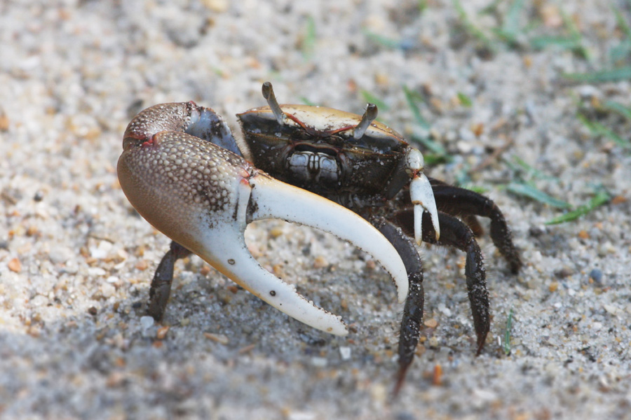
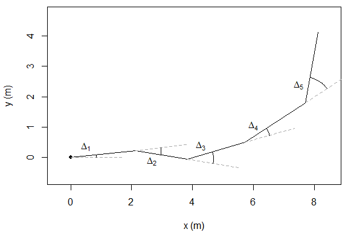
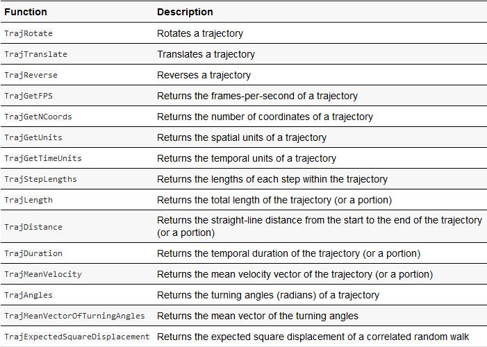
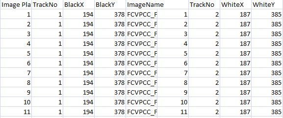

class: center, middle
##Why study trajectories of animals?

--

May provide insight on how they utilize path integration and social learning.

--

  Ants
```{r, echo = FALSE, out.height="100px", fig.align='center'}
knitr::include_graphics("ants1.jpg")
```


--

  Crabs
```{r, echo = FALSE, out.height="100px", fig.align='center'}

```


--

  Bees
```{r, echo = FALSE, out.height="100px", fig.align='center'}
knitr::include_graphics("bees1.jpg")
```


---
```{r, echo = FALSE, out.height="350px", fig.align='center'}

```
A correlated random walk with 5 steps. The direction of step i is the direction of step (i−1)+Δi.

What is a trajectory:
1. Two or three spatial dimensions
2. Time based (its own dimension)
    
---
#The Basics
```{r}
library(trajr)
# Define x, y, and time coordinates
coords <- data.frame(x = c(1, 1.5, 2, 2.5, 3, 4), 
                     y = c(0, 0, 1, 1, 2, 1), 
                     times = c(0, 1, 2, 3, 4, 5))
# Create a trajectory from the coordinates
trj <- TrajFromCoords(coords)

```
---
#The Basics
```{r, fig.align='center', out.height="350px"}
# Plot it
plot(trj)
```
---

Here are some functions:

--
```{r, echo=FALSE, fig.align='center', out.height="350px"}

```

---

##How do we use TRAJR?

--

Read from a csv file

--
```{r, fig.align='center', out.height="250px"}
library(trajr)


```

---
##Use CSV files 
```{r, echo=FALSE, fig.align='center', out.height="350px"}
library(readr)
test_coordinates <- read.csv("test coordinates.csv")
coords <- data.frame(x = test_coordinates$BlackX, 
                     y = test_coordinates$BlackY,
                     times = test_coordinates$Image.Plane)

```
--
convert coordinates to a 'traj' object
```{r}
traj <- TrajFromCoords(coords)
traj
```
---
##Let's do something useful: Characterize the data
```{r}
characteriseTrajectory <- function(trj) {
  # Measures of speed
  derivs <- TrajDerivatives(trj)
  mean_speed <- mean(derivs$speed)
  sd_speed <- sd(derivs$speed)
  
  # Measures of straightness
  sinuosity <- TrajSinuosity(trj)
  resampled <- TrajRediscretize(trj, .001)
  Emax <- TrajEmax(resampled)
  
  # Return a list with all of the statistics for this trajectory
  list(mean_speed = mean_speed,
       sd_speed = sd_speed,
       sinuosity = sinuosity,
       Emax = Emax
  )
}

# Calculate all stats for trajectories in the list
# which was built in the previous example

```
---
#Here are the results
```{r}
characteriseTrajectory(traj)
```

---
##References

McLean, D. J., & Skowron Volponi, M. A. (2018). trajr: An R package for characterisation of animal trajectories. Ethology, 124(6), 440-448. https://doi.org/10.1111/eth.12739

##Link to package tutorial

https://cran.r-project.org/web/packages/trajr/vignettes/trajr-vignette.html

---