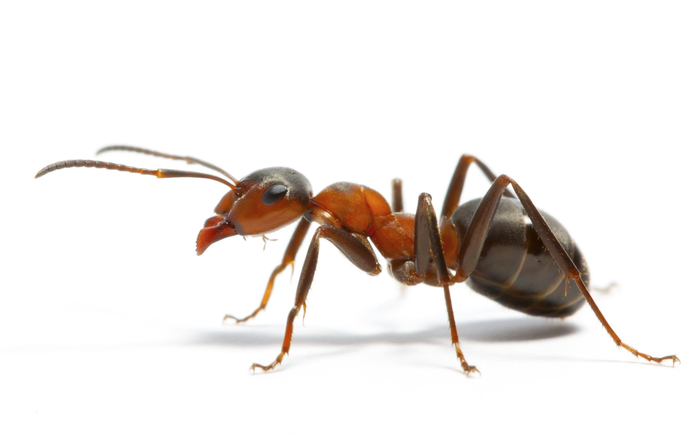

class: center, middle
##Why study trajectories of animals?

--

May provide insight on how they utilize path integration.

--

  Ants
```{r, echo = FALSE, out.height="100px", fig.align='center'}

```


--

  Crabs
```{r, echo = FALSE, out.height="100px", fig.align='center'}
knitr::include_graphics("crab1.jpg")
```


--

  Bees
```{r, echo = FALSE, out.height="100px", fig.align='center'}
knitr::include_graphics("bees1.jpg")
```


---
class: inverse, center, middle 

next slide

      - bullet point
    - another bullet
    
---
```{r, echo = FALSE, fig.align='center'}
#can use fig.height (in pixels, range 2-inf)
#can use out.height="200px"
a <- rnorm(10,0,1)
hist(a)
```
---
#add external image

```{r, echo = FALSE, out.height="200px"}

```
---
#columns

.pull-left[
Some tex

]

.pull-right[
ahh this looks right

]

---
SHow this

--

then this

--

then this
